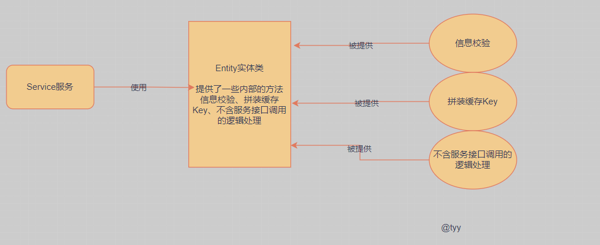

## 1.DDD是什么

DDD是一种软件设计方法，也就是说DDD是指导我们做出软件设计工程的一种手段，它提供了多种切割工程模型的技巧，例如**领域、界限上下文、值对象、实体对象、聚合对象、工厂、仓储等**。通过DDD的指导思想，我们可以在前期投入更多的时间，更加合理的规划出可持续迭代的工程设计

在 DDD 中有一套共识的工程两阶段设计手段，包括：战略设计、战术设计

**战略设计**

主要以应对复杂的业务需求，通过抽象、分治的过程，合理的拆分为独立的多个微服务，从而分而治之。

以大营销平台为例，类似抽奖模块和openAi模块的关系，将整个大营销平台拆分为多个微服务。

**战术设计**

在这个范畴下，主要以讨论如何基于面向对象思维，运用领域模型来表达业务概念。所以这一阶段要设计每一个可以表达领域概念的模型，并运用实体、聚合、领域服务来承载。

指的是单个模块下不同功能的按照领域划分吗，并且提供充血模型（行为对象和功能逻辑高度绑定，而不是像MVC架构那样交叉使用）

<br/>

## 2.DDD相关的概念

<br/>

### 2.1充血模型

充血模型，**指将对象的属性信息与行为逻辑聚合到一个类中**，常用的手段如在对象内提供属于当前对象的信息校验、拼装缓存Key、不含服务接口调用的逻辑处理等。



```java
/**
 * 以抽奖模块的策略（Strategy）领域w的实体类（Entity）StrategyEntity为例子
 * 根据当前的库表设计提供了两个方法
 * 1.ruleModels 获取当前策略下的规则模型的数组
 * 2.getRuleWeight 判断当前策略下是否存在权重规则
*/
@Data
@Builder
@AllArgsConstructor
@NoArgsConstructor
public class StrategyEntity {

    /**
     * 抽奖策略ID
     */
    private Long strategyId;
    /**
     * 抽奖策略描述
     */
    private String strategyDesc;
    /**
     * 抽奖规则模型 rule_weight,rule_blacklist
     */
    private String ruleModels;

    public String[] ruleModels() {
        if (StringUtils.isBlank(ruleModels)) return null;
        return ruleModels.split(Constants.SPLIT);
    }

    public String getRuleWeight() {
        String[] ruleModels = this.ruleModels();
        if (null == ruleModels) return null;
        for (String ruleModel : ruleModels) {
            if ("rule_weight".equals(ruleModel)) return ruleModel;
        }
        return null;
    }

}
```

**我的理解**

成员变量+api+专供某个领域 = 充血模型

成员变量+api+交叉调用 = 贫血模型

<br/>

**补充**

1. 这样的方式可以在使用一个对象时，就顺便拿到这个对象的提供的一系列方法信息，所有使用对象的逻辑方法，都不需要自己再次处理同类逻辑。
2. 但不要只是把充血模型，仅限于一个类的设计和一个类内的方法设计。充血还可以是整个包结构，一个包下包括了用于实现此包 Service 服务所需的各类零部件（模型、仓储、工厂），也可以被看做充血模型。
3. 同时我们还会再一个同类的类下，提供对应的内部类，如用户实名，包括了，通信类、实名卡、银行卡、四要素等。它们都被写进到一个用户类下的内部子类，这样在代码编写中也会清晰的看到子类的所属信息，更容易理解代码逻辑，也便于维护迭代。