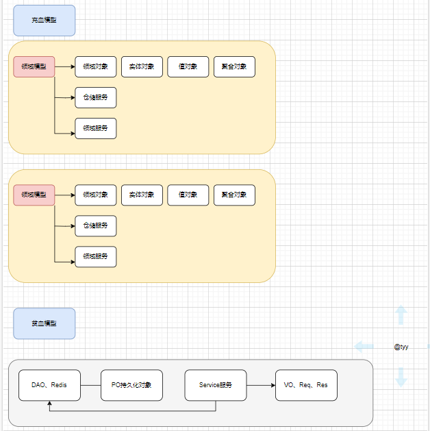
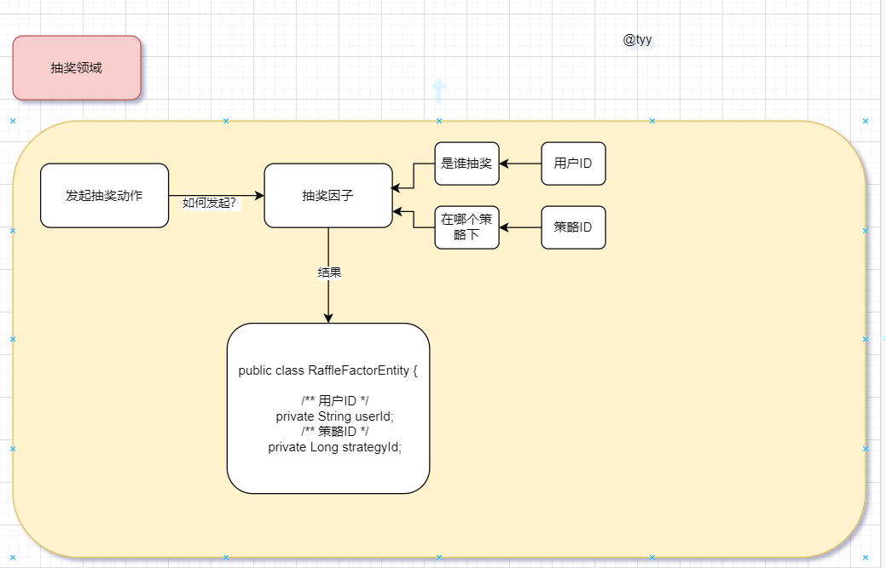

## 1.DDD是什么

DDD是一种软件设计方法，也就是说DDD是指导我们做出软件设计工程的一种手段，它提供了多种切割工程模型的技巧，例如**领域、界限上下文、值对象、实体对象、聚合对象、工厂、仓储等**。通过DDD的指导思想，我们可以在前期投入更多的时间，更加合理的规划出可持续迭代的工程设计

在 DDD 中有一套共识的工程两阶段设计手段，包括：战略设计、战术设计

**战略设计**

主要以应对复杂的业务需求，通过抽象、分治的过程，合理的拆分为独立的多个微服务，从而分而治之。

以大营销平台为例，类似抽奖模块和openAi模块的关系，将整个大营销平台拆分为多个微服务。

**战术设计**

在这个范畴下，主要以讨论如何基于面向对象思维，运用领域模型来表达业务概念。所以这一阶段要设计每一个可以表达领域概念的模型，并运用实体、聚合、领域服务来承载。

指的是单个模块下不同功能的按照领域划分吗，并且提供充血模型（行为对象和功能逻辑高度绑定，而不是像MVC架构那样交叉使用）

<br/>

## 2.DDD相关的概念

<br/>

### 2.1充血模型

充血模型，**指将对象的属性信息与行为逻辑聚合到一个类中**，常用的手段如在对象内提供属于当前对象的信息校验、拼装缓存Key、不含服务接口调用的逻辑处理等。


```java
/**
 * 以抽奖模块的策略（Strategy）领域w的实体类（Entity）StrategyEntity为例子
 * 根据当前的库表设计提供了两个方法
 * 1.ruleModels 获取当前策略下的规则模型的数组
 * 2.getRuleWeight 判断当前策略下是否存在权重规则
*/
@Data
@Builder
@AllArgsConstructor
@NoArgsConstructor
public class StrategyEntity {

    /**
     * 抽奖策略ID
     */
    private Long strategyId;
    /**
     * 抽奖策略描述
     */
    private String strategyDesc;
    /**
     * 抽奖规则模型 rule_weight,rule_blacklist
     */
    private String ruleModels;

    public String[] ruleModels() {
        if (StringUtils.isBlank(ruleModels)) return null;
        return ruleModels.split(Constants.SPLIT);
    }

    public String getRuleWeight() {
        String[] ruleModels = this.ruleModels();
        if (null == ruleModels) return null;
        for (String ruleModel : ruleModels) {
            if ("rule_weight".equals(ruleModel)) return ruleModel;
        }
        return null;
    }

}
```

**我的理解**

成员变量+api+专供某个领域 = 充血模型

成员变量+api+交叉调用 = 贫血模型

<br/>

**补充**

1. 这样的方式可以在使用一个对象时，就顺便拿到这个对象的提供的一系列方法信息，所有使用对象的逻辑方法，都不需要自己再次处理同类逻辑。
2. 但不要只是把充血模型，仅限于一个类的设计和一个类内的方法设计。充血还可以是整个包结构，一个包下包括了用于实现此包 Service 服务所需的各类零部件（模型、仓储、工厂），也可以被看做充血模型。
3. 同时我们还会再一个同类的类下，提供对应的内部类，如用户实名，包括了，通信类、实名卡、银行卡、四要素等。它们都被写进到一个用户类下的内部子类，这样在代码编写中也会清晰的看到子类的所属信息，更容易理解代码逻辑，也便于维护迭代。

<br/>

### 2.2领域模型

<br/>

**领域模型**

指特定业务领域内，业务规则、策略以及业务流程的抽象和封装。在设计手段上，通过风暴模型拆分领域模块，形成界限上下文。最大的区别在于把原有的众多 Service + 数据模型的方式，拆分为独立的有边界的领域模块。每个领域内创建自身所属的；领域对象（实体、聚合、值对象）、仓储服务(DAO 操作)、工厂、端口适配器Port（调用外部接口的手段）等。



<br/>

### 2.3实体、聚合、值对象

**贫血模型下**

对方法的出入参数不是很在意，因为交叉使用的缘故，一个VO中包含十个成员变量，A服务要3个，B服务要6个，都可以使用该VO对象

**DDD领域模型设计中**

对model对象的使用进行了细致的划分，区分为实体、聚合、值对象

**实体对象**
概念：

是依托于持久化层数据以领域服务功能目标为指导设计的领域对象。持久化PO对象是原子类对象，不具有业务语义，而实体对象是具有业务语义且有唯一标识的对象，跟随于领域服务方法的全生命周期对象。如；用户PO持久化对象，会涵盖，用户的开户实体、授信实体、额度实体对象。也包括如商品下单时候的购物车实体对象。这个对象也通常是领域服务方法的入参对象。

我的理解：

官方概念还是比较的晦涩难懂，第一句话**是依托于持久化层数据以领域服务功能目标为指导设计的领域对象。**简单概括一下就是基于PO的成员变量+基于所需服务提供的方法。这个还比较好理解，主要的难点在于一个领域中，如何确定你要创建的实体对象？确定好创建的实体对象长啥样（所需的属性），那么对应的服务其实是水到渠成的。我这里以抽奖模块中，抽奖领域为例子，下面做一张思维导图：



<br/>

<br/>

**值对象**

<br/>

概念：

这个对象在领域服务方法的生命周期过程内是不可变对象，也没有唯一标识。它通常是配合实体对象使用。如为实体对象提供对象属性值的描述，比如；一个公司雇员的级别值对象，一个下单的商品收货的四级地址信息对象。所以在开发值对象的时候，通常不会提供 setter 方法，而是提供构造函数或者 Builder 方法来实例化对象。这个对象通常不会独立作为方法的入参对象，但做可以独立作为出参对象使用。

<br/>

用途：

金额和货币（如价格、工资、费用等）
度量和数据（如重量、长度、体积等）
范围或区间（如日期范围、温度区间等）
复杂的数学模型（如坐标、向量等）
任何其他需要封装的属性集合

<br/>

**聚合对象**

概念：

当你对数据库的操作需要使用到多个实体时，可以创建聚合对象。一个聚合对象，代表着一个数据库事务，具有事务一致性。聚合中的实体可以由聚合提供创建操作，实体也被称为聚合根对象。一个订单的聚合，会涵盖；下单用户实体对象、订单实体、订单明细实体和订单收货四级地址值对象。而那个作为入参的购物车实体对象，已经被转换为实体对象了。—— 聚合内事务一致性，聚合外最终一致性。

<br/>

我的理解：

抽奖模块-奖品领域中构建了两个聚合对象，用户中奖记录聚合对象和发放奖品聚合对象，前者用来存储抽奖订单下达后的奖品订单+任务（保证成功发送mq消息），后者也是一个奖品订单（前一个插入，后一个更新），然后还有一个积分订单。

构建聚合对象的目的就是在逻辑上阶段性操作数据库时，方便获取对应的实体，已经进行事务操作和补偿操作。

<br/>

### 2.4仓储和适配器

<br/>

**概念**

在 DDD 的设计方法中，领域层做到了只关心领域服务实现。最能体现这样设计的就是仓库和适配器的设计。通常在 Service + 数据模型的设计中，会在 Service 中引入 Redis、RPC、配置中心等各类其他外部服务。但在 DDD 中，通过仓储和适配器以及基础设施层的定义，解耦了这部分内容。

**特征（理解）：**

1. 封装持久化操作：Repository负责封装所有与数据源交互的操作，如创建、读取、更新和删除（CRUD）操作。这样，领域层的代码就可以避免直接处理数据库或其他存储机制的复杂性。（像是把MVC架构的service的业务逻辑和数据处理拆分开了）
2. 领域对象的集合管理：Repository通常被视为领域对象的集合，提供了查询和过滤这些对象的方法，使得领域对象的获取和管理更加方便。（服务和仓储之间交互的对象是领域对象）
3. 抽象接口：Repository定义了一个与持久化机制无关的接口，这使得领域层的代码可以在不同的持久化机制之间切换，而不需要修改业务逻辑。(意思是注入IDao直接用就可以，不单独绑定？)

<br/>

**实现手段：**

领域层->repository包->对应的仓储接口

基础层->persistent包->repository包->实现

<br/>

### 2.5领域编排

**概念：**

在 DDD 中，每一个领域都是界限上下文拆分的独立结果，而实现业务流程的功能则需要串联各个领域模块提供一整条链路的完整服务。所以也常说领域内事务一致性，领域外最终一致性。

同时这些领域模块因为是独立的，所以也可以被复用。在不同的场景功能诉求下，可以选择不同的领域模块进行组装，这个过程就像搭积木一样。

但这里有一个取舍，如果项目相对来说并不大，也没有太多的编排处理。那么可以直接让触发器层对接领域层，减少编排层后，编码会更加便捷。

<br/>

### 2.6触发器

**概念：**

在所有的模型都定义完成后，领域业务被串联了。那么接下来则是使用，而使用的方式可以包括；接口（http/rpc）、消息监听、定时任务等方式，这些方式统一被定义为触发动作。

在大营销-抽奖模块中使用了**http接口、消息监听（记录落库）、定时任务（库存落库，消费redis阻塞队列的内容）**
