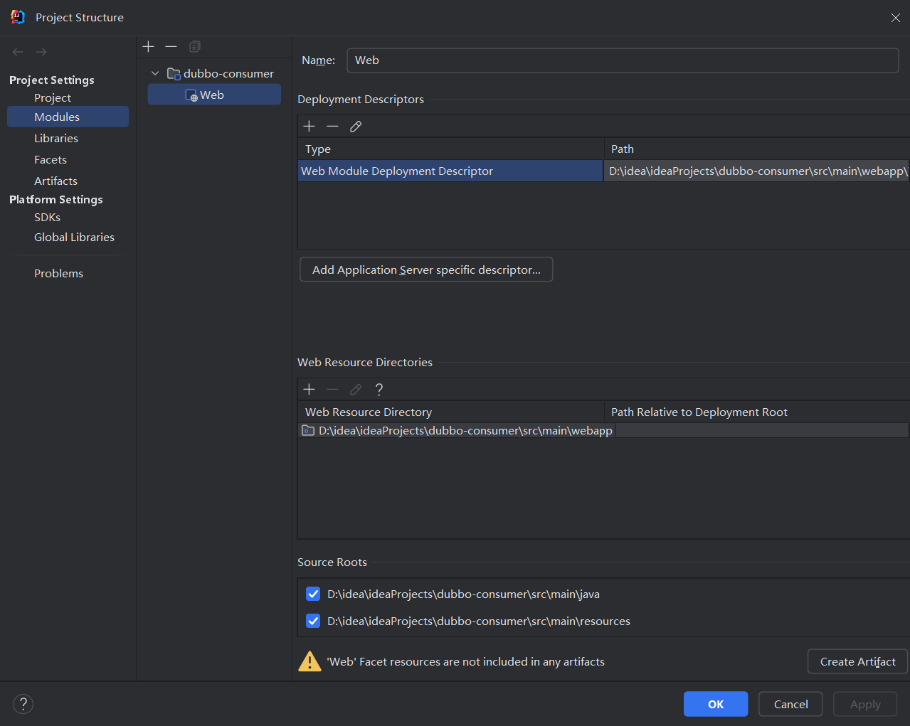
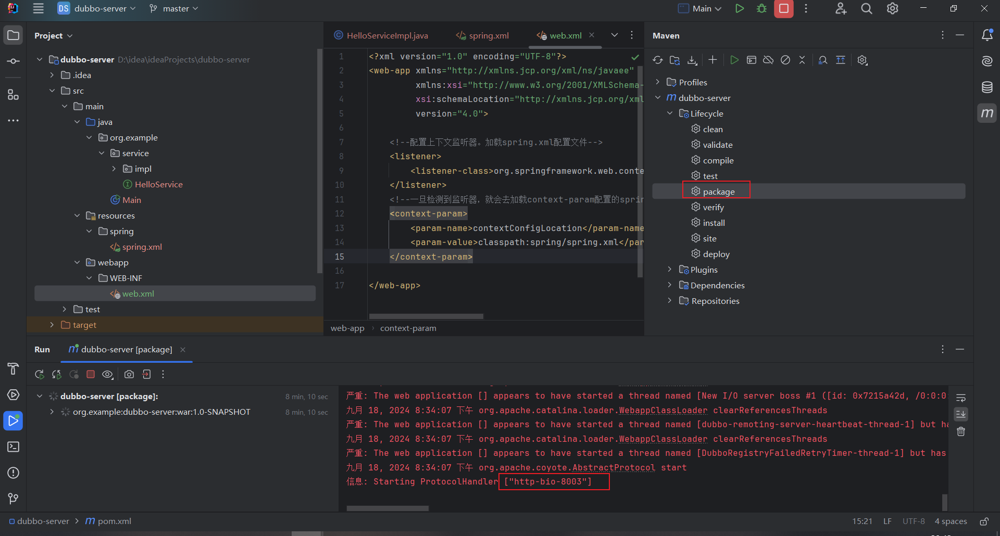
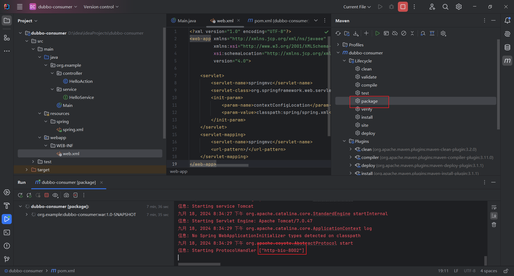
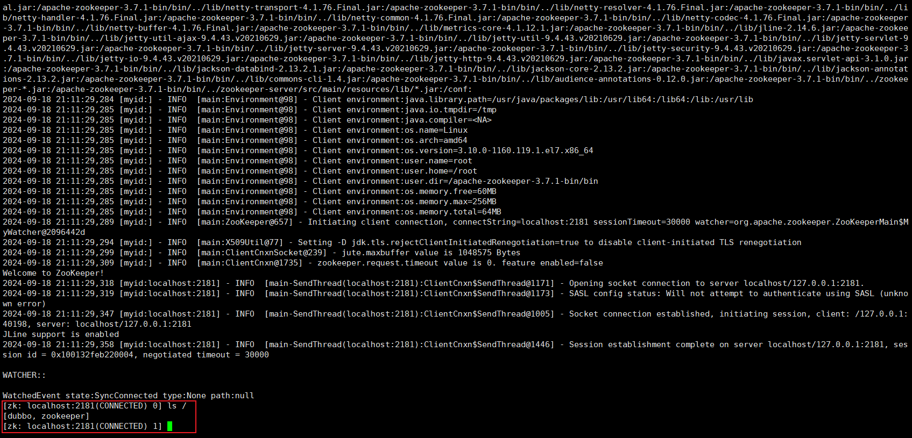
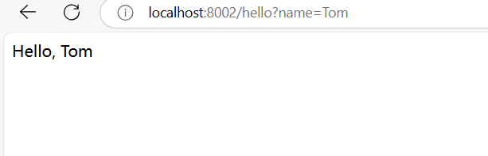

## 2.3服务消费方

### 2.3.1步骤

1.创建一个项目，dubbo-consumer的maven项目

2.创建webapp目录



3.导入依赖，和上一个样例一样，仅仅在端口方面作出调整

```xml
 <packaging>war</packaging>
    <properties>
        <!--jdk版本 视频中是11 我是8-->
        <maven.compiler.source>8</maven.compiler.source>
        <maven.compiler.target>8</maven.compiler.target>
        <project.build.sourceEncoding>UTF-8</project.build.sourceEncoding>
        <!--版本和视频保持一致-->
        <spring.version>5.0.6.RELEASE</spring.version>
    </properties>
    <dependencies>
        <dependency>
            <groupId>org.springframework</groupId>
            <artifactId>spring-webmvc</artifactId>
            <version>${spring.version}</version>
        </dependency>
        <dependency>
            <groupId>org.springframework</groupId>
            <artifactId>spring-core</artifactId>
            <version>${spring.version}</version>
        </dependency>
        <dependency>
            <groupId>org.springframework</groupId>
            <artifactId>spring-beans</artifactId>
            <version>${spring.version}</version>
        </dependency>
        <dependency>
            <groupId>org.springframework</groupId>
            <artifactId>spring-context</artifactId>
            <version>${spring.version}</version>
        </dependency>
        <dependency>
            <groupId>org.springframework</groupId>
            <artifactId>spring-context-support</artifactId>
            <version>${spring.version}</version>
        </dependency>
        <dependency>
            <groupId>org.springframework</groupId>
            <artifactId>spring-tx</artifactId>
            <version>${spring.version}</version>
        </dependency>
        <!--Dubbo-->
        <dependency>
            <groupId>com.alibaba</groupId>
            <artifactId>dubbo</artifactId>
            <version>2.5.7</version>
        </dependency>
        <!--zookeeper-->
        <dependency>
            <groupId>org.apache.zookeeper</groupId>
            <artifactId>zookeeper</artifactId>
            <version>3.4.6</version>
        </dependency>
        <!--zookeeper客户端-->
<!--        <dependency>-->
<!--            <groupId>com.gith.sgroschupf</groupId>-->
<!--            <artifactId>zkclient</artifactId>-->
<!--            <version>0.1</version>-->
<!--        </dependency>-->
        <dependency>
            <groupId>javassist</groupId>
            <artifactId>javassist</artifactId>
            <version>3.11.0.GA</version>
        </dependency>
    </dependencies>
    
    <build>
        <plugins>
            <plugin>
                <groupId>org.apache.tomcat.maven</groupId>
                <artifactId>tomcat7-maven-plugin</artifactId>
                <version>2.2</version>
                <configuration>
                    <port>8002</port>
                    <path>/</path>
                </configuration>
                <executions>
                    <execution>
                        <!--打包完成之后，运行服务-->
                        <phase>package</phase>
                        <goals>
                            <goal>run</goal>
                        </goals>
                    </execution>
                </executions>
            </plugin>
        </plugins>
    </build>
```

<br/>

4.声明业务层，为了和服务端相互调用，把客户端的业务层接口和服务提供方的业务层接口保持一致，但是不需要写实现。

5.消费方声明控制层，处理客户端的请求。依赖注入使用的dubbo的分布式注解@Reference

```java
package org.example.service;

 //服务消费方：需要和服务提供方的业务层接口保持一致，同时该接口的抽象方法也需要保持一致。
 // 但是不需要实现，消费方的接口实现是依赖服务提供方来完成的。
public interface HelloService {
    String sayHello(String name);
}


package org.example.controller;

import com.alibaba.dubbo.config.annotation.Reference;
import org.example.service.HelloService;
import org.springframework.web.bind.annotation.RequestMapping;
import org.springframework.web.bind.annotation.RestController;

@RestController
public class HelloAction {
    //将Zookeeper注册中心中的dubbo-service的服务提供注册的具体的服务
    @Reference()
    private HelloService helloService;

    @RequestMapping("/hello")
    public String hello(String name){
        //前端传过来一个Tom用户名，返回:"Hello Tom"
        return helloService.sayHello(name);
    }
}

```

<br/>

6.在注册中心中配置消费方的应用名称

```xml
<?xml version="1.0" encoding="UTF-8"?>
<beans xmlns="http://www.springframework.org/schema/beans"
       xmlns:xsi="http://www.w3.org/2001/XMLSchema-instance"
       xmlns:dubbo="http://code.alibabatech.com/schema/dubbo"
       xsi:schemaLocation="
http://www.springframework.org/schema/beans
http://www.springframework.org/schema/beans/spring-beans.xsd
http://code.alibabatech.com/schema/dubbo
http://code.alibabatech.com/schema/dubbo/dubbo.xsd">


    <!--1.给服务提供者在Zookeeper注册中心中设置注册名称-->
    <dubbo:application name="dubbo-consumer"/>
    <!--2.配置Dubbo注册中心对应的Zookeeper地址/ip-->
    <dubbo:registry address="zookeeper://101.126.84.62:2181"/>
    <!--3.配置Dubbo的包扫描，识别哪一些方法被@Reference修饰-->
    <dubbo:annotation package="org.example.controller"/>

</beans>

```

<br/>

7.Dubbo配置

```xml
<?xml version="1.0" encoding="UTF-8"?>
<web-app xmlns="http://xmlns.jcp.org/xml/ns/javaee"
         xmlns:xsi="http://www.w3.org/2001/XMLSchema-instance"
         xsi:schemaLocation="http://xmlns.jcp.org/xml/ns/javaee http://xmlns.jcp.org/xml/ns/javaee/web-app_4_0.xsd"
         version="4.0">
    
    <servlet>
        <servlet-name>springmvc</servlet-name>
        <servlet-class>org.springframework.web.servlet.DispatcherServlet</servlet-class>
        <init-param>
            <param-name>contextConfigLocation</param-name>
            <param-value>classpath:spring/spring.xml</param-value>
        </init-param>
    </servlet>
    <servlet-mapping>
        <servlet-name>springmvc</servlet-name>
        <url-pattern>/</url-pattern>
    </servlet-mapping>
</web-app>
```

8.启动服务测试，先启动服务端，再启动客户端，顺序不能颠倒，其次端口不要冲突了。

<br/>





<br/>

9.登陆zookeeper客户端查看是否注册成功。进入到如下目录，执行sh文件，进入客户端，然后ls/查询，显示dubbo，证明连接成功。最后访问以下controller服务。

<br/>






<br/>

<br/>

### 2.3.2个人理解

<br/>

说实话有点迷糊，因为我一开始学习的就是springboot下的开发，springbbot简化了很多对于springmvc的配置，所以我很少接触到web.xml配置文件的编写。

但是还算是能够理解吧，消费端配置文件是用来，用于配置 Servlet 和 URL 映射。1首先是制定了一个Servlet服务：springmvc，然后指定初始化要加载的配置文件：spring.xml，最终我们通过映射将所有的请求都交给springmvc处理。

服务端配置文件就是配置了上下文监听器，然后配置上下文参数，目的是告诉应用启动时，通过 ContextLoaderListener 加载并初始化 Spring 的应用上下文，所有的 Spring 配置文件会根据 contextConfigLocation 中的路径来加载。

**后续肯定还是在springboot环境下开发的，到时候应该就是在Application.yml文件中配置了。**