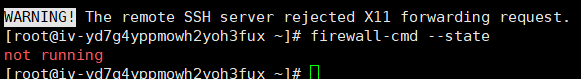
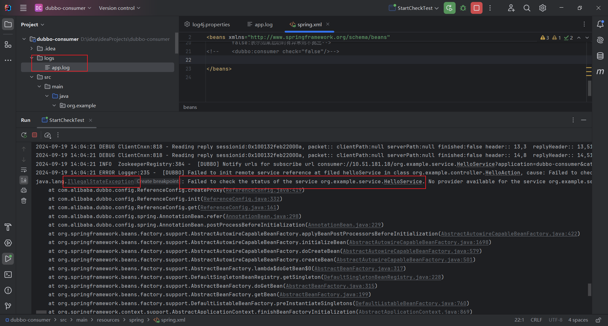
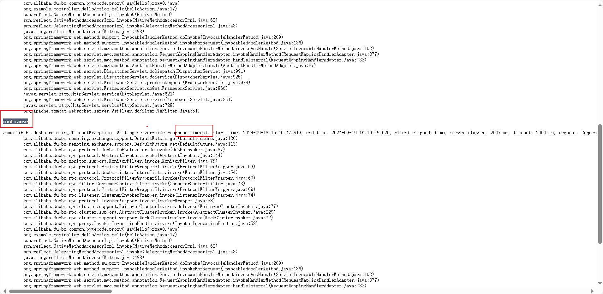
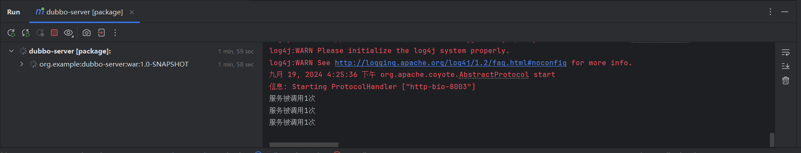

## 2.3 bug解析

总结一下可能存在的问题

### 2.3.1 防火墙关闭

```
//查看防火墙的状态
firewall-cmd --state
//关闭防火墙（临时关闭）
service firewalled stop
```

显然我的防火墙被关闭了



### 2.3.2 引入@Service注解

引入的@Service注解应该是Dubbo包下的

```
com. alibaba. dubbo. config. annotation
```

不是Spring包下的

```
org. springframework. stereotype
```

<br/>

## 3.监控中心

在软件开发中，如果需要知道注册中心中，到底注册了哪些服务，有哪些消费方...如果能获取到以上的信息，**最好是可视化的**，可以方便软件开发者的开发和测试。

图形化展示注册中心服务列表的信息工具，可以通过部署一个图形化工具来管理分布式系统中的各种服务。

<br/>

dubbo-monitor-simple-2.5.3.zip

dubbo-admin-master.zip压缩包，直接解压到任意非中文目录下（必备常识）

<br/>

## 4.Dubbo综合实战

### 4.1 配置说明

### 4.1.1 启动时检查

在服务注册中心注册的服务是否相互可用，如果不可用，直接可以抛出异常。阻止了后续的操作，方便代码在上线前进行维护。**早发现错误，早解决。**默认是开启这个功能的，但是在实际上线之后，是需要关闭的，所以下面讲解如何开启和关闭。

1.消费方，读取Spring.xml文件

测试一下启动是否会检测异常

2.日志文件

方便打印异常

4log4j.peoperties

```xml
# 设置日志级别
log4j.rootLogger=DEBUG, stdout, file

# 控制台输出
log4j.appender.stdout=org.apache.log4j.ConsoleAppender
log4j.appender.stdout.layout=org.apache.log4j.PatternLayout
log4j.appender.stdout.layout.ConversionPattern=%d{yyyy-MM-dd HH:mm:ss} %-5p %c{1}:%L - %m%n

# 文件输出
log4j.appender.file=org.apache.log4j.RollingFileAppender
log4j.appender.file.File=logs/app.log
log4j.appender.file.MaxFileSize=5MB
log4j.appender.file.MaxBackupIndex=10
log4j.appender.file.layout=org.apache.log4j.PatternLayout
log4j.appender.file.layout.ConversionPattern=%d{yyyy-MM-dd HH:mm:ss} %-5p %c{1}:%L - %m%n

```

3.结果展示

没有检查到服务的存在



4.Dubbo配置

```xml
<!--1.给服务提供者在Zookeeper注册中心中设置注册名称-->
    <dubbo:application name="dubbo-consumer"/>
    <!--2.配置Dubbo注册中心对应的Zookeeper地址/ip-->
    <dubbo:registry address="zookeeper://101.126.84.62:2181"/>
    <!--3.配置Dubbo的包扫描，识别哪一些方法被@Reference修饰-->
    <dubbo:annotation package="org.example.controller"/>
    <!--关闭服务启动时检查异常
        true:表示如果启动有异常则抛出
        false:表示如果启动时有异常则不抛出-->
    <dubbo:consumer check="false"/>
```

<br/>

再次在服务端未启动时运行，虽然仍然有日志输出，但是没有抛出异常信息

<br/>

### 4.1.2 超时时间

由于计算机网络的不稳定、服务期处于繁忙的状态，该场景下导致客户端处于阻塞的状态。客户端的资源处于挂起的状态（其他操作无法执行），所以需要设置超时时间。

1.在服务提供方进行设置。

2.在服务端模拟一个耗时操作。

默认的超时时间为1s，我们可以手动设置。

```
 <!--1.给服务提供者在Zookeeper注册中心中设置注册名称-->
    <dubbo:application name="dubbo-server"/>
    <!--2.配置Dubbo注册中心对应的Zookeeper地址/ip-->
    <dubbo:registry address="zookeeper://101.126.84.62:2181"/>
    <!--3.配置Dubbo的包扫描，识别哪一些类被@Service修饰，将被扫描的类进行服务发布-->
    <dubbo:annotation package="org.example.service.impl"/>
    <!--超时时间-->
    <dubbo:provider timeout="2000"/>
```

3.结果

<br/>



<br/>

<br/>

### 4.1.3 重试次数

在出现对应的请求失败时，自动让客户端再次请求服务，具体请求的次数可以由开发者来确定。Dubbo的重试次数默认为2。

1.配置重试次数

```xml
<!--重试次数
        消费者如果连接服务请求失败，再次重新请求retries指定的次数-->
    <dubbo:provider retries="3"/>
```

2.修改输出，方便查看实际调用次数

```java
package org.example.service.impl;

import com.alibaba.dubbo.config.annotation.Service;
import org.example.service.HelloService;

@Service
public class HelloServiceImpl implements HelloService {
    @Override
    public String sayHello(String name) {
        try {
            System.out.println("服务被调用1次");
            Thread.sleep(3000);
        } catch (InterruptedException e) {
            e.printStackTrace();
        }
        return "Hello, "+name;
    }
}

```

<br/>

3.查看服务端输出结果

一共调用了3次（视频里是4次，没搞懂，按理来说重试次数不包括第一次访问的，应该输出四次服务被调用？）



<br/>

### 4.1.4 版本控制

如果一个接口有多个实现类（多个版本），可以指定调用服务端哪一个实现类。 

启动服务消费端调用时服务提供方的HelloServiceImpl02实现类。

1.在服务提供方，给每一个类配置一个版本号。

```xml
 <!--给提供的服务配置版本号-->
    <dubbo:service interface="org.example.service.HelloService" class="org.example.service.impl.HelloServiceImpl" version="0.0.1"/>
    <dubbo:service interface="org.example.service.HelloService" class="org.example.service.impl.HelloServiceImpl02" version="0.0.2"/>

```

<br/>

2.在服务消费方，配置具体要消费的服务信息

注意注解和xml文件配置不要混合使用，使用注解注入就不要再使用xml配置，我建议使用注解，比较方便

```xml
 <!--给提供的服务配置版本号-->
<!--    <dubbo:service interface="org.example.service.HelloService" class="org.example.service.impl.HelloServiceImpl" version="1.0.0"/>-->
<!--    <dubbo:service interface="org.example.service.HelloService" class="org.example.service.impl.HelloServiceImpl02" version="2.0.0"/>-->

```

3.效果


<br/>

**还可以使用星号来匹配任意版本，随机调用**

### 4.1.5 疑问解答

1.为什么超时时间是在服务提供者配置的？因为服务的提供者比起使用者更加清楚服务的性能，例如调用的超时时间、合理的重试次数等。**但是也可以在消费方配置**，当服务提供者配置后，消费者不配置就默认使用服务端的配置。