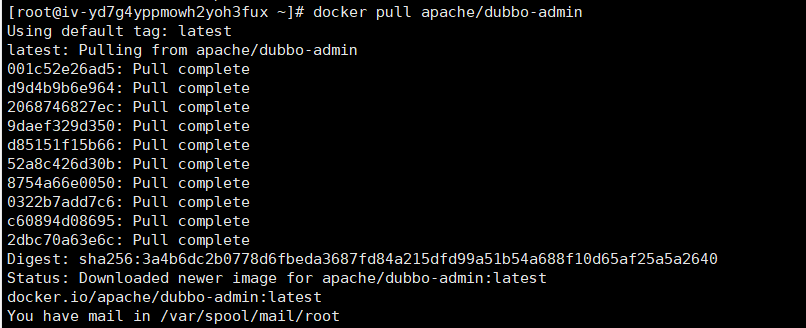
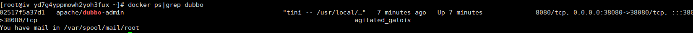
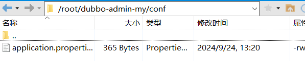
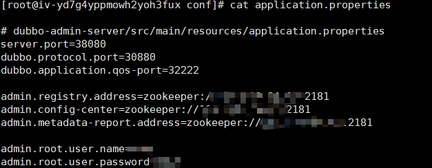
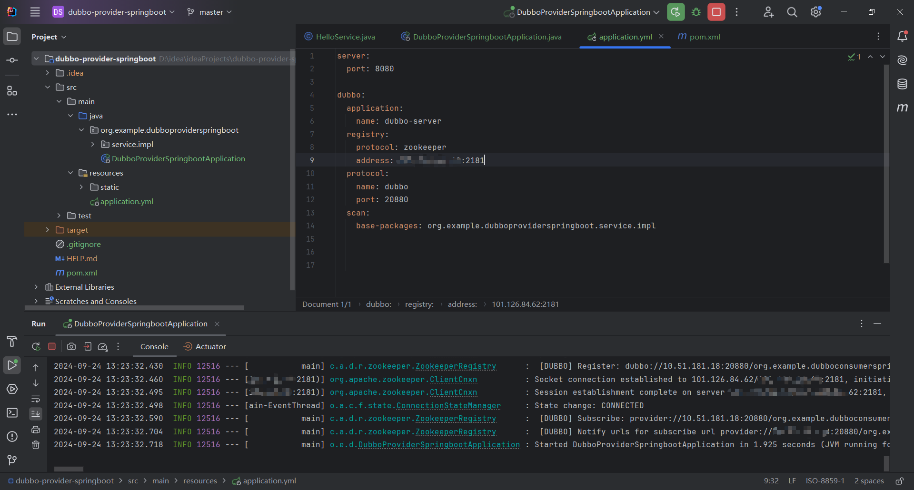
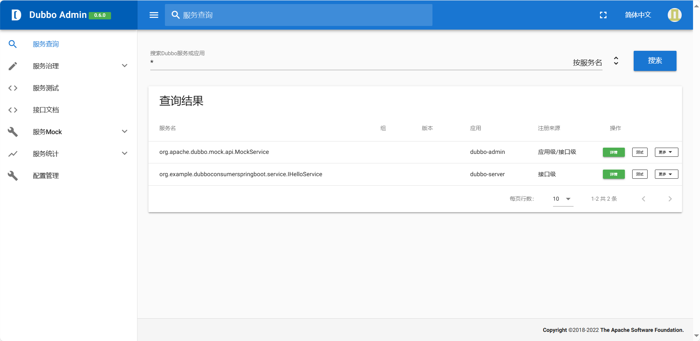

## 使用 Docker 搭建 dubbo admin

### **第一步：拉取镜像文件**

```
docker pull apache/dubbo-admin
```

默认拉去的是latest 最新版本，支持jdk8+dubbo3.x



检查镜像是否存在



<br/>

### **第二步：创建启动配置文件目录，并且编写配置文件，配置zookeeper的位置**

```
cd /root
mkdir -p  dubbo-admin-my/conf
```

<br/>





<br/>

### **第三步：后台启动，映射主机的虚拟目录到主机中的实际目录**

```
docker run -d --rm -v /root/dubbo-admin-my/conf:/config -p 38080:38080 apache/dubbo-admin
```

访问地址，启动dubbo服务提供者，检查是否启动成功，以及功能是否正常



