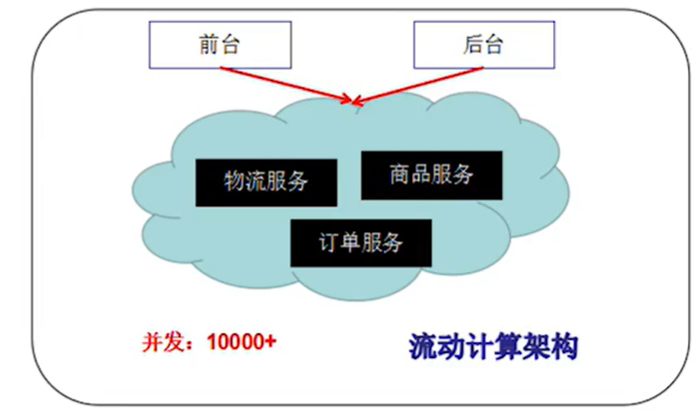

[B站学习课程](https://www.bilibili.com/video/BV1qd4y1v7ED?p=7&spm_id_from=pageDriver&vd_source=3c401e9b12aadd668c92b73995070898)

## 1 Dubbo基本概念

### 1.1 什么是分布式系统

1.最早在一本书中被提到《分布式原理和规范》：

- ”分布式系统是由若干台独立计算机的集合，这些计算机对于用户来说相当于单个相关系统“ 分布式系统是建立在网络之上的软件系统。
- 简单理解：多个人（不同职责）共同完成一件事情。
- 任何一台单独的主机（服务器）都无法满足高并发的业务，请求的吞吐量是有限的，当搭建为分布式环境后，很多台来共同处理同一个业务。

2.概念：三个臭皮匠，赛过诸葛亮。

### 1.2 互联网架构演变

#### 1.2.1 单一应用架构

当网站流量很小时，只需要一个应用，将所有的功能部署到一起，从而减少部署节点和成本

例如这个博客网站

**1.优点**

1. 小项目开发快，成本低。
2. 架构简单。
3. 功能比较少，益于测试和维护。
4. 方便部署。

**2.缺点**

1. 大项目的模块设计复杂，耦合度非常高，不易于代码维护，沟通和成本高。
2. 新增业非常困难。
3. 核心业务和边缘业务混杂在一起，出现问题互相影响。

 

#### 1.2.2 垂直架构

 

当访问的请求逐渐增大的时候，单一架构很难去提升系统的性能。将单一的架构进行拆分，拆分成互相不影响的几个模块（独立的应用程序），从而提高开发的效率。

大的模块按照MVC分层的思想（DDD也行），形成若干个小的模块，每一个小的模块独立的运行在服务器上。前端页面独立进行部署。

 

 

缺点：模块之间不能完全的没有交集（耦合），公共的模块无法进行复用，开发变得代码冗余（开发性能的浪费）。

 

#### 1.2.3 分布式服务架构

当垂直架构应用越来越多，应用之间相互不可避免会有牵连，将核心功能进行抽离，作为独立的业务，逐渐形成一个独立的模块。

此时，用户代码复用提高，代码之间的冗余度降低。

 

RPC：独立的应用服务之间，依赖RPC协议进行通信（服务之间的相互调用），Romote Procedure Call。

如果物流模块此时存在十台服务器，此时特别的繁忙；而订单模块也有十台服务器，可是处于闲置的状态。出现了服务器资源的浪费。如何能够实现服务器资源的调度呢？

 

#### 1.2.4 流动计算框架

当服务越来越多，容量的评估，小服务资源的浪费等问题逐渐呈现，此时需要一个调度中心基于访问压力实时管理集群容量，提高集群利用率。

此时，用于提高机器利用率的资源调度和治理中心（SOA）是关键。

 

SOA：面向服务架构（Service Oriented Architecture），简单理解：服务治理。例如公交系统的总调度员。

 

## 1.3 Dubbo介绍

#### 1.3.1 Dubbo概述

DUbbo是一个分布式的框架，最早是由阿里巴巴公司开源的一个项目，现在交给了Apache公司管理。

Dubbo主要致力于提高应用程序的性能和透明化的RPC远程服务调用的解决方案的一个框架。

简单总结：Dubbo是一个服务框架，如果没有分布式的业务场景，是不需要使用Dubbo的。

 

#### 1.3.2 RPC原理

1.RPC，Remote Procedure Call，远程过程调用，是一种进程间的通信手段。

2.RPC基本的通信原理：

1. 在客户端将对象序列化；
2. 底层通信框架选择Netty（基于tcp协议的socket），将序列化对象发送给服务提供方；
3. 服务提供方通过Socket拿到数据文件之后，进行反序列化，获取要操作的对象；
4. 对象数据操作完毕，将新的对象序列化，再通过服务提供方的Socket返还给客户端；
5. 客户端拿到序列化数据后，再反序列化，得到最新的数据对象，至此，完成一次请求。

 

3.RPC的两个核心：通信（Socket-TCP协议）、序列化（实现Serializable接口，才能够在网络上传输）