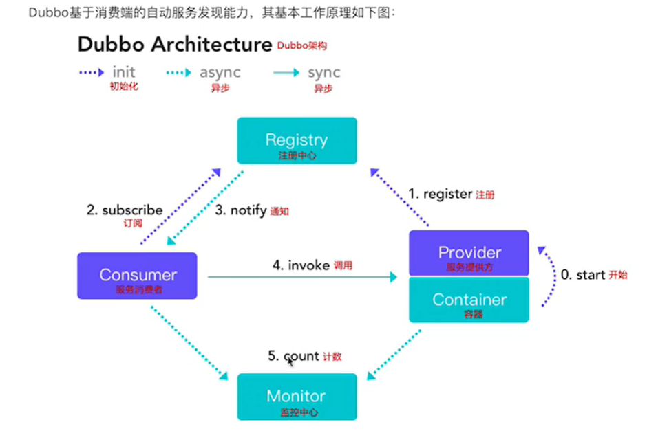
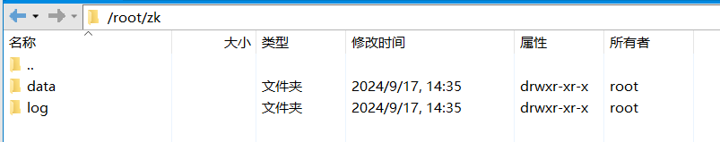
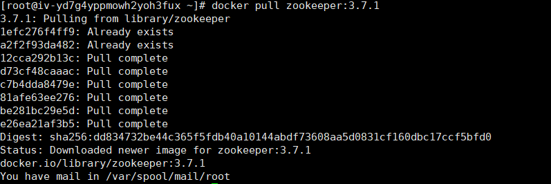
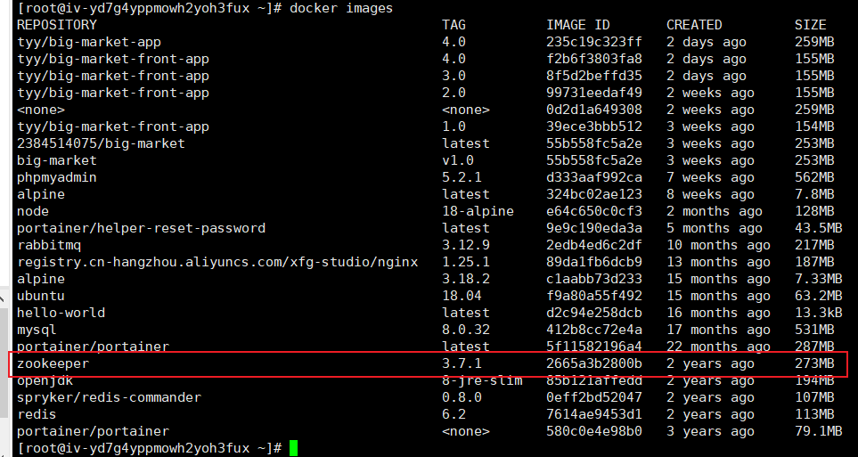
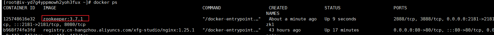
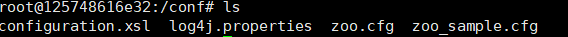
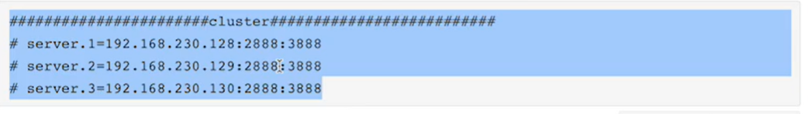

### 1.3.3 节点角色

|节点|角色说明|
|--|:--|
|Provider|暴露服务的提供方|
|Consumer|调用远程服务的消费方|
|Registry|服务注册与发现中心|
|Monitor	|统计服务的调用次数和调用时间的监控中心，在内存中累计调用次数和调用时间，定时每分钟发送一次统计数据到监控中心|
|Container			|服务运行容器|

<br/>



<br/>

<br/>

### 1.3.4 调用关系

1.服务容器，主要负责服务的启动、加载、运行服务。（类似于Spring容器）

2.服务提供者在启动时，需要向注册中心注册提及提供的服务。（类似于注册到BeanDefinitionMap中）

3.服务消费者在启动时，向注册中心订阅自己所需要的服务。（注入 DI）

4.注册中心返回服务列表给到服务的消费者，如果有变更，注册中心将基于长连接推送变更的数据。

5.服务消费，从提供的服务列表中，获取到对应的服务后，去调用远程服务关联的业务逻辑。

6.监控中心，将服务消费者和服务提供者在内存中（Redis？频繁操作的数据存储在内存中确实比较好）累计被访问和调用次数，每一分钟进行一次统计。

<br/>

<br/>

## 2 Dubbo的快速入门

Apache Dubbo 是一款微服务框架，为大规模的微服务提供**流量治理（流量均衡的分发）、高效的RPC通信、可观测的监控平台**等等解决方案。

涵盖了：Java、Golang等多种计算机语言的支持。

### 2.1 注册中心

### 2.1.1 Zookeeper

1.Dubbo推荐的注册中心Zookeeper。

2.注册中心负责服务地址的注册和服务地址的查询(提供服务的ip和目录)。

3.服务提供方和服务消费方只在启动时与注册中心进行交互（注册、获取），注册中心不负责具体请求的处理（请求转发），压力非常小（不需要考虑注册中心的性能）。

4.Zookeeper是Apache Hadoop的子项目，可以为大数据领域提供服务。

5.Dubbo的服务注册中心，使用Zookeeper可以提高，比较适合生产环境。

<br/>

### 2.1.2 安装Zookeeper

<br/>

我是使用docker部署的，和视频中有点区别，但大致上还是一个道理。

1. 准备好存放data和log的文件夹/目录
2. 
3. docker pull zookeeper:3.7.1（[docker部署博客](https://blog.csdn.net/qq_58221659/article/details/131795005)是用的这个版本，目前最新是3.9，我怕和jdk不匹配，我是jdk1.8的，没敢使用太新的版本）
4. 
5. docker images查看是否拉取镜像成功
6. 
7. 通过命令启动容器，以及开放服务器端口（这博客不是-d后台启动的，给我整愣住了，ctrl+c直接退出，然后在portainer上启动的）
8. ```
   docker run -p 2181:2181 -v /home/zk1/data:/data -v /home/zk1/log:/datalog --env TZ=Asia/Shanghai --name zk1 zookeeper:3.7.1
    
   # 参数详细说明：
   #  -p 2181:2181   绑定端口，将容器内端口绑定到宿主机端口，zookeeper默认端口2181
    
   #  -v /home/zk1/data:/data -v /home/zk1/log:/datalog   将容器内的/data以及/datalog目录分别挂载到宿主机/home/zk1/data和/home/zk1/log目录，容器内/data、/datalog所产生的文件会映射宿主机到对应目录
    
   #  --env TZ=Asia/Shanghai   将容器内时区设为国内正确时区，指定的是上海时区，如果未设置则日志时间会相差8个小时
    
   #  --name zk1  设置名为zk1的容器
    
   #  zookeeper:3.7.1   选择镜像，笔者上方安装的是3.7.1，所以选择镜像时要注意自己所安装的镜像，也可以直接输入镜像ID
    
   ```
9. docekr ps查看是否启动成功
10. 
11. 进入控制台
12. 
13. cd /conf然后ls可以看到配置文件
14. 
15. 其中zoo.cfg是真正的配置文件，zoo_sample.cfg是模板文件

<br/>

**集群转单点**

视频中，一开始是部署的集群环境，如果是这种情况，从集群恢复到单点，要将cluser对应的server给注释掉



**windows命令行远程连接命令 PowerShell**

```
ssh root@地址
```

<br/>

**非docker部署的启动命令**

```
//到bin目录下
cd /bin
//启动
./ZkServer.sh start


```

<br/>

### 2.2 服务提供方

### 2.2.1 需求分析

Dubbo提供了Spring框架的整合依赖，视频中为2.5.7。

<br/>

### 2.2.2 操作步骤

1.创建一个项目dubbo-server的maven类型项目。

2.web app的目录结构生成。

3.导入依赖（没资料，手敲麻了）。

4.创建HelloService接口，定义抽象方法。

```java
package org.example.service;

public interface HelloService {
    //参数要求是客户端：dubbo-consumer提供的
    String sayHello(String name);
}

```

5.编写实现类，@Service选择Dubbo提供的注解，表示被标记的类创建对象交给Spring来维护，用来修饰服务提供者的业务对象的。将来这些方法才能注册到Zookeeper中。

```java
package org.example.service.impl;

import com.alibaba.dubbo.config.annotation.Service;
import org.example.service.HelloService;

@Service
public class HelloServiceImpl implements HelloService {
    @Override
    public String sayHello(String name) {
        return "Hello, "+name;
    }
}

```

6.Dubbo配置文件编写，注册服务到Zookeeper中

```xml
<?xml version="1.0" encoding="UTF-8"?>
<beans xmlns="http://www.springframework.org/schema/beans"
       xmlns:xsi="http://www.w3.org/2001/XMLSchema-instance"
       xmlns:dubbo="http://code.alibabatech.com/schema/dubbo"
       xsi:schemaLocation="
http://www.springframework.org/schema/beans
http://www.springframework.org/schema/beans/spring-beans.xsd
http://code.alibabatech.com/schema/dubbo
http://code.alibabatech.com/schema/dubbo/dubbo.xsd">


    <!--1.给服务提供者在Zookeeper注册中心中设置注册名称-->
    <dubbo:application name="dubbo-server"/>
    <!--2.配置Dubbo注册中心对应的Zookeeper地址/ip-->
    <dubbo:registry address="zookeeper://101.126.84.62:2181"/>
    <!--3.配置Dubbo的包扫描，识别哪一些类被@Service修饰，将被扫描的类进行服务发布-->
    <dubbo:annotation package="org.example.service.impl"/>

</beans>

```

<br/>

<br/>

### 2.2.3 依赖版本

这里zookeeper的版本可以是新的版本，因为zookeeper是向下兼容的，可以使用老的依赖去连接新的zookeeper；另外，这里的zookeeper客户端的依赖我下载不到，之后用到了再说，先注释了；**不是springboot就把依赖按照官方推荐的配置好，springboot可以自动管理适配的版本，所以方便些**

```
<?xml version="1.0" encoding="UTF-8"?>
<project xmlns="http://maven.apache.org/POM/4.0.0"
         xmlns:xsi="http://www.w3.org/2001/XMLSchema-instance"
         xsi:schemaLocation="http://maven.apache.org/POM/4.0.0 http://maven.apache.org/xsd/maven-4.0.0.xsd">
    <modelVersion>4.0.0</modelVersion>

    <groupId>org.example</groupId>
    <artifactId>dubbo-server</artifactId>
    <version>1.0-SNAPSHOT</version>
    <!--声明项目的打包方式为war-->
    <packaging>war</packaging>
    <properties>
        <!--jdk版本 视频中是11 我是8-->
        <maven.compiler.source>8</maven.compiler.source>
        <maven.compiler.target>8</maven.compiler.target>
        <project.build.sourceEncoding>UTF-8</project.build.sourceEncoding>
        <!--版本和视频保持一致-->
        <spring.version>5.0.6.RELEASE</spring.version>
    </properties>
    <dependencies>
        <dependency>
            <groupId>org.springframework</groupId>
            <artifactId>spring-webmvc</artifactId>
            <version>${spring.version}</version>
        </dependency>
        <dependency>
            <groupId>org.springframework</groupId>
            <artifactId>spring-core</artifactId>
            <version>${spring.version}</version>
        </dependency>
        <dependency>
            <groupId>org.springframework</groupId>
            <artifactId>spring-beans</artifactId>
            <version>${spring.version}</version>
        </dependency>
        <dependency>
            <groupId>org.springframework</groupId>
            <artifactId>spring-context</artifactId>
            <version>${spring.version}</version>
        </dependency>
        <dependency>
            <groupId>org.springframework</groupId>
            <artifactId>spring-context-support</artifactId>
            <version>${spring.version}</version>
        </dependency>
        <dependency>
            <groupId>org.springframework</groupId>
            <artifactId>spring-tx</artifactId>
            <version>${spring.version}</version>
        </dependency>
        <!--Dubbo-->
        <dependency>
            <groupId>com.alibaba</groupId>
            <artifactId>dubbo</artifactId>
            <version>2.5.7</version>
        </dependency>
        <!--zookeeper-->
        <dependency>
            <groupId>org.apache.zookeeper</groupId>
            <artifactId>zookeeper</artifactId>
            <version>3.4.6</version>
        </dependency>
        <!--zookeeper客户端-->
<!--        <dependency>-->
<!--            <groupId>com.gith.sgroschupf</groupId>-->
<!--            <artifactId>zkclient</artifactId>-->
<!--            <version>0.1</version>-->
<!--        </dependency>-->
        <dependency>
            <groupId>javassist</groupId>
            <artifactId>javassist</artifactId>
            <version>3.11.0.GA</version>
        </dependency>
    </dependencies>

</project>
```