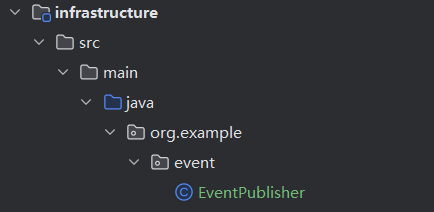
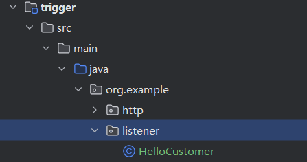
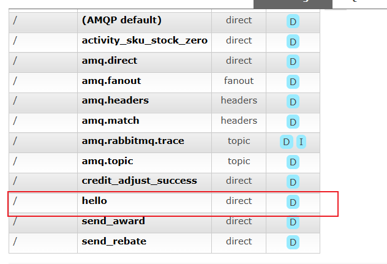
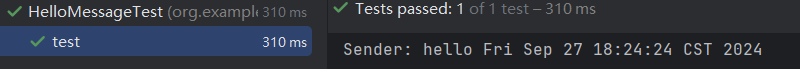

## 使用RabbitMQ干什么？

rabbitmq是一个消息队列，消息中间件，在java项目中（也不一定非得是java项目），主要有以下三个功能：

1. 解耦：例如订单系统，创建一个订单，就将其存放到mq中，等待其他的系统录入库存来调用，这种架构，即便是库存服务宕机了，也不会影响订单系统的正常运转。
2. 异步：假如有一个用户注册功能，注册的时候要发送短信和邮件，理解为调用短信服务和邮件服务，这种时候就可以将注册信息写入mq，实现短信和邮件并发处理。
3. 削峰：用户的大量请求的场景，例如团购和秒杀，使用rabbitmq作为存储，然后慢慢的交给数据库处理。

<br/>

## Java对接RabbitMQ

<br/>

### 1.创建maven项目

这里我使用的是之前**部署**笔记中的maven-test项目

### 2.导入RabbitMQ依赖包

依赖的选择不止一个，我这个依赖是springboot官方整合的，比较方便使用

```
<!--RabbitMQ-->
        <dependency>
            <groupId>org.springframework.boot</groupId>
            <artifactId>spring-boot-starter-amqp</artifactId>
        </dependency>
```

<br/>

### 3.yml配置

配置rabbitmq的服务地址（ip和端口号），然后配置用户名和密码

```
  spring:
    rabbitmq:
      host: xxxx
      port: 5672
      username: admin
      password: admin
```

<br/>

### 4.在基础层提供消息发送功能

<br/>



先写一个消息发送的demo，后续进行拓展，例如发送的消息腰包封装成**消息类对象**。

```
/**
 * RabbitMQ消息发送类
 */
@Component
public class EventPublisher {
    @Autowired
    private RabbitTemplate rabbitTemplate;

    public void send(){
        String context = "hello "+new Date();
        System.out.println("Sender: "+context);
        rabbitTemplate.convertAndSend("hello",context);
    }
}

```

### 5.在触发器层创建消费者



<br/>

通过application.yml文件提供主题，和代码解耦

```
abbitmq:
    host: xxx
    port: 5672
    username: admin
    password: admin
    topic:
      hello: hello
```

<br/>

在rabbitmq控制台创建对应的队列



<br/>

<br/>

消费者代码

```
@Component
public class HelloCustomer {
    @Value("${spring.rabbitmq.topic.hello}")
    private String topic;

    @RabbitListener(queuesToDeclare = @Queue(value = "${spring.rabbitmq.topic.hello}"))
    public void listener(String message){
        System.out.println("收到消息 "+message);
    }
}
```

### 6.在测试类中测试消息是否能够成功消费

<br/>

首先引入junit依赖，并且指定生效范围为test

```
<!--junit-->
        <dependency>
            <groupId>junit</groupId>
            <artifactId>junit</artifactId>
            <scope>test</scope>
        </dependency>
```

<br/>

在app启动模块下创建test类

这是基本格式

```
@SpringBootTest
@RunWith(SpringRunner.class)
public class Test {
    
}

```

<br/>

这是实际测试代码。SpringBootTest是用于启动Spring Boot环境的注解。它会加载整个应用上下文，使你能够在测试中使用Spring的特性和配置。

RunWith是JUnit的注解，用于指定测试运行器。使用@RunWith(SpringRunner.class)来整合Spring测试框架），以便获取IOC容器实例并在测试中使用。

```
@SpringBootTest
@RunWith(SpringRunner.class)
public class HelloMessageTest {
    @Autowired
    private EventPublisher eventPublisher;

    @Test
    public void test(){
        eventPublisher.send();
    }
}
```

<br/>

**建议分目录些测试类，方便回顾和管理，我这里根据功能划分包名**

<br/>

**结果如图**

