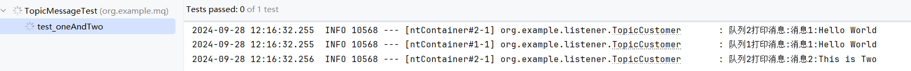

## 通过配置类，配置topic模式的消息

<br/>

### 背景

上一章的实现是基于简单模式实现的，一个队列和一个或者多个消费者，当然这对于一些场景已经足够使用了，本来目的也就是做一个简单的解耦。例如将订单创建和库存扣减做一个解耦，使得订单系统和库存系统相互独立。

但是对于不同的交换机的使用还是要学习的，接下来就是springboot整合rabbitmq下，广播模式和主题模式的使用。

<br/>

## 主题模式

<br/>

### 配置类代码

编写配置类，声明了队列1和队列2，分别路由:

topic.one

topic.#

```
package org.example.config;

import org.springframework.amqp.core.Binding;
import org.springframework.amqp.core.BindingBuilder;
import org.springframework.amqp.core.Queue;
import org.springframework.amqp.core.TopicExchange;
import org.springframework.beans.factory.annotation.Value;
import org.springframework.context.annotation.Bean;
import org.springframework.context.annotation.Configuration;

/**
 * 主题模式
 */
@Configuration
public class TopicRabbitConfig {

    @Value("${spring.rabbitmq.queue.topic1}")
    private String topic1;
    @Value("${spring.rabbitmq.queue.topic2}")
    private String topic2;
    @Value("${spring.rabbitmq.exchange.exchange1}")
    private String exchange1;
    /**
     * 声明两个队列
     * @return
     */
    @Bean
    Queue queue_one(){
        return new Queue(topic1);
    }
    @Bean
    Queue queue_two(){
        return new Queue(topic2);
    }

    /**
     * 声明交换机
     * @return
     */
    @Bean
    public TopicExchange exchange(){
        return new TopicExchange(exchange1);
    }

    /**
     * 将队列注册到交换机，路由key为topic1
     * 通过构造器传入bean对象，通过变量名指定具体对象
     * @param queue_one
     * @param exchange
     * @return
     */
    @Bean
    Binding bindingExchangeOne(Queue queue_one,TopicExchange exchange){
        /**
         * 路由key：topic.one
         */
        return BindingBuilder.bind(queue_one).to(exchange).with("topic.one");
    }

    /**
     * 将队列注册到交换机，路由key为topic2
     * 通过构造器传入bean对象，通过变量名指定具体对象
     * @param queue_two
     * @param exchange
     * @return
     */
    @Bean
    Binding bindingExchangeTwo(Queue queue_two,TopicExchange exchange){
        /**
         * 路由key：topic. 后买跟上 零个或者多个词
         */
        return BindingBuilder.bind(queue_two).to(exchange).with("topic.#");
    }


}

```

<br/>

### 消费者代码

<br/>

```
package org.example.listener;

import lombok.extern.slf4j.Slf4j;
import org.springframework.amqp.rabbit.annotation.Queue;
import org.springframework.amqp.rabbit.annotation.RabbitListener;
import org.springframework.beans.factory.annotation.Value;
import org.springframework.stereotype.Component;

@Component
@Slf4j
public class HelloCustomer {
    @Value("${spring.rabbitmq.queue.hello}")
    private String topic;

    @RabbitListener(queuesToDeclare = @Queue(value = "${spring.rabbitmq.queue.hello}"))
    public void listener(String message){
        log.info("收到消息:{}",message);
    }
}


```

<br/>

<br/>

### 测试类代码

<br/>

```
package org.example.mq;

import org.example.config.RedissonConfig;
import org.example.config.TopicRabbitConfig;
import org.junit.Test;
import org.junit.runner.RunWith;
import org.springframework.amqp.rabbit.core.RabbitTemplate;
import org.springframework.beans.factory.annotation.Autowired;
import org.springframework.beans.factory.annotation.Value;
import org.springframework.boot.test.context.SpringBootTest;
import org.springframework.test.context.junit4.SpringRunner;

import java.util.concurrent.CountDownLatch;

@SpringBootTest
@RunWith(SpringRunner.class)
public class TopicMessageTest {
    @Autowired
    RabbitTemplate rabbitTemplate;

    @Value("${spring.rabbitmq.exchange.exchange1}")
    String exchange1;

    private CountDownLatch latch = new CountDownLatch(2);  // 预期接收两个消息

    @Test
    public void test_oneAndTwo() throws InterruptedException {
        rabbitTemplate.convertAndSend(exchange1,"topic.one","消息1:Hello World");
        rabbitTemplate.convertAndSend(exchange1,"topic.xxx","消息2:This is Two");

        
        
        latch.await();
    }
}

```

<br/>

### 结果

一开始没有使用CountDownLatch，导致test结束了，日志还没有打印。

可以看到，消息1路由到了两个队列中被消费，消息2路由到了队列2中被消费。

这是由匹配规则决定的。



<br/>

## @RabbitListener和@RabbitHandler的区别

@RabbitListener 和 @RabbitHandler 是 Spring AMQP 中用于处理 RabbitMQ 消息的两个注解，但它们的用途不同：

### @RabbitListener

**用途：**用于标记一个方法或者类，以表明该方法或者类会接受来自指定队列的消息。

**功能：**可以定义监听的队列、交换机等配置。它通常用在类级别或方法级别上，表示这个类或方法是一个消息消费者。

**示例：**

```
@RabbitListener(queues = "myQueue")
public void receiveMessage(String message) {
    // 处理消息
}

```

<br/>

### @RabbitHandler

**用途：**用于标记一个方法，以表明该方法处理特定类型的消息。

**功能：**当一个类上有多个 @RabbitListener 方法时，可以通过 @RabbitHandler 来区分不同消息类型的处理逻辑。它可以根据方法参数的类型来选择处理相应的消息。

**示例：**

```
@RabbitListener(queues = "myQueue")
public class MyMessageReceiver {

    @RabbitHandler
    public void handleStringMessage(String message) {
        // 处理字符串消息
    }

    @RabbitHandler
    public void handleIntegerMessage(Integer number) {
        // 处理整数消息
    }
}

```

<br/>

## @RabbitListener注解中，两个指定队列的属性 queuesToDeclare和queues的区别

前者如果指定的队列不存在，会自动创建队列。后者则是需要存在的对垒。

前者在我的个人项目中是配合默认交换机使用的，我们发送消息仅仅指定了消息内容和路由键，那么就会将该消息发送到默认交换机，并且路由到对应的队列中，这个队列由queuesToDeclare创建。

后者是配合配置类一起使用，在配置类中存在完整的交换机、队列、绑定关系，可以很好的完成职责。

<br/>

## 出现的问题

本次学习的文章是

[点击这](https://netfilx.github.io/spring-boot/8.springboot-rabbitmq/springboot-rabbitmq)

该文章中，没有使用@Value注解，而是直接在配置类中编写的内容，并且通过static修饰，方便调用。我寻思也用static修饰了exchange1，结果导致了空指针异常。这是因为静态变量在程序启动时最先被初始化，而@Value是在创建bean对象的时候处理并且注入的，静态变量不在这个流程中。