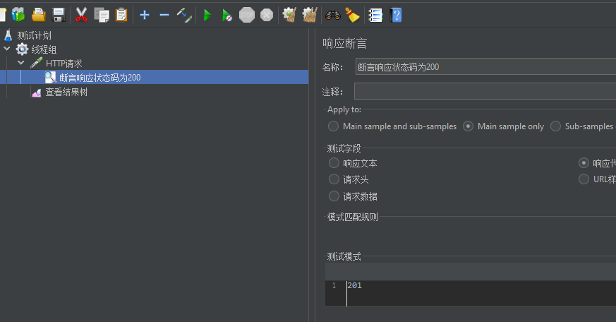

## JMeter安装

基于java开发的Jemeter，所以在安装之前需要有一个运行Java代码的**JDK环境**，笔者是JDK1.8。

环境变量的设置都在这篇帖子里[点击](https://blog.csdn.net/Shi_MM/article/details/126280735)。

 

## JMeter和Postman的区别

都是测试请求的工具。Postman的好处就是小巧轻便，界面也比较好看；而JMeter功能比较强大，可以做压测，还能够连接数据库，做一些数据删除的动作；另外JMeter是有中文界面的（官方），而Postman没有。

 

## 自动化测试

通过工具或者代码代替人类去进行测试的一个活动。

 

## 第一个案例

需求：使用JMeter访问百度首页接口，并且查看请求和响应信息。

### 步骤

1. 启动JMeter
2. 在**测试计划**中添加**线程组**
3. 在**线程组**下添加**HTTP请求**取样器
4. 填写**HTTP请求**相关的数据
5. 在**线程组**下添加**查看结果树**监听器
6. 点击**启动**按钮运行，并且查看结果

 

第一步：添加线程组，第二步:添加HTTP请求，第三部：添加查看结果树

 

 

填入协议、ip地址、访问端口（没有就是默认端口）、HTTP请求方式、路径（静态资源目录？）。

 

结果树上查看HTTP请求的结果。

 

 

## JMeter断言

**断言**：让程序自动判断预期结果和实际结果是否一致。

- JMeter在请求的返回层面有个自动判断机制（响应状态码）
- 但是请求成功了，并不代表结果一定正确，因此需要检测机制来提高测试准确性

**JMeter中常用断言：**

- 响应断言（响应状态吗是不是200？）
- JSON断言（是否存在我们想看的数据？例如www.baidu.com的响应中有没有**百度一下，你就知道**）

 

### 响应断言

作用：对HTTP请求的任意和格式的响应结果进行断言。

位置：测试计划->线程组->HTTP请求->（右键添加）断言->响应断言。

 

### 响应断言案例

响应状态码为200，人为让断言失败

 

### JSON断言

作用：对HTTP请求的JSON格式的响应结果进行断言。

位置：测试计划->线程组->HTTP->(右键添加)断言->JSON断言。

 

### JSON断言案例

 

期望得到南京

实际得到北京

