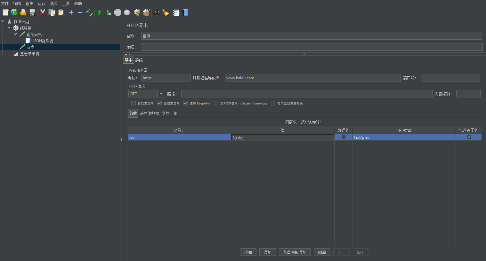

<br/>

## 概述

### JMeter安装

基于java开发的Jemeter，所以在安装之前需要有一个运行Java代码的**JDK环境**，笔者是JDK1.8。

环境变量的设置都在这篇帖子里[点击](https://blog.csdn.net/Shi_MM/article/details/126280735)。

<br/>

### JMeter和Postman的区别

都是测试请求的工具。Postman的好处就是小巧轻便，界面也比较好看；而JMeter功能比较强大，可以做压测，还能够连接数据库，做一些数据删除的动作；另外JMeter是有中文界面的（官方），而Postman没有。

<br/>

### 自动化测试

通过工具或者代码代替人类去进行测试的一个活动。

<br/>

### 第一个案例

需求：使用JMeter访问百度首页接口，并且查看请求和响应信息。

 **步骤**

1. 启动JMeter
2. 在**测试计划**中添加**线程组**
3. 在**线程组**下添加**HTTP请求**取样器
4. 填写**HTTP请求**相关的数据
5. 在**线程组**下添加**查看结果树**监听器
6. 点击**启动**按钮运行，并且查看结果

<br/>

第一步：添加线程组，第二步:添加HTTP请求，第三部：添加查看结果树


<br/>

<br/>

填入协议、ip地址、访问端口（没有就是默认端口）、HTTP请求方式、路径（静态资源目录？）。


<br/>

结果树上查看HTTP请求的结果。


<br/>

<br/>

## JMeter自动判定运行结果

**断言**：让程序自动判断预期结果和实际结果是否一致。

- JMeter在请求的返回层面有个自动判断机制（响应状态码）
- 但是请求成功了，并不代表结果一定正确，因此需要检测机制来提高测试准确性

**JMeter中常用断言：**

- 响应断言（响应状态吗是不是200？）
- JSON断言（是否存在我们想看的数据？例如www.baidu.com的响应中有没有**百度一下，你就知道**）

<br/>

### 响应断言

作用：对HTTP请求的任意和格式的响应结果进行断言。

位置：测试计划->线程组->HTTP请求->（右键添加）断言->响应断言。

<br/>

### 响应断言案例

响应状态码为200，人为让断言失败


<br/>


### JSON断言

作用：对HTTP请求的JSON格式的响应结果进行断言。

位置：测试计划->线程组->HTTP->(右键添加)断言->JSON断言。

<br/>

### JSON断言案例

<br/>

期望得到南京


实际得到北京


<br/>

## JMeter高效管理测试数据（参数化）

### 1.全局变量

**问题：**

如果要访问某一个请求10次，要求每一次请求发送不同的参数值，该怎么实现？

**作用：**

定义全局变量。

**位置：**

测试计划->线程组->配置元件->用户定义的变量。

**操作：**

在测试计划下定义全局变量（任何地方使用${变量名}可以引用）

例如${aaa}


<br/>

### 2.CSV数据文件设置

**作用：**

让不同用户在多次循环时，可以取到不同的值。

**位置：**

测试计划->线程组->配置元件->CSV数据文件设置。

**请求：**

https://www.baidu.com

**要求：**

循环请求三次，要求每次的参数username、password、code的值不同

**操作步骤:**

1.定义CSV文件

2.添加线程组，设置循环次数为3


3.添加CSV数据文件设置


4.添加HTTP请求


5.查看结果树


<br/>

## 自动关联依赖解决

**解决的问题：**

请求之间存在关联，一个请求的返回结果是另一个请求的入参，这时候就需要使用到关联处理。

<br/>

### JSON提取器

**作用：**

对JSON格式的响应结果数据进行提取。

**位置：**

在HTTP请求后添加后置处理器->JSON提取器

**练习：**

1.请求获取天气的接口，http://www.weather.com.cn/data/sk/101010100.html，返回结果中的城市名称“北京”。

2.请求：https://www.baidu.com/s?wd=北京，将获取到的城市名称作为参数。

**步骤：**

1.先测试一下能不能提取响应的city北京


2.添加后置处理器


3.引入参数



4.查看结果树


<br/>

## JMeter连接数据库

### **作用**

1. 用作请求的参数化
2. 用作结果的断言
3. 清理垃圾数据
4. 准备测试数据

### 配置

1.添加MySQL驱动jar包（我添加的maven仓库里面的）

- 方式一：在测试计划面板下点击“浏览...“按钮，将JDBC驱动添加
- 方式二：将MySQL驱动jar包添加到lib/ext目录下，重启JMeter


2.配置数据库连接信息（配置元件）


3.添加JDBC请求（取样器）


4.查看结果树

**问题1：驱动名称**

mysql8和mysql5的驱动名称不同，com.mysql.cj.jdbc.Driver和com.mysql.jdbc.Driver，就是一个cj的区别

**问题2：时区设置**

jdbc:mysql://localhost:3306/RUNOOB**?useSSL=false&serverTimezone=UTC**


<br/>

## JMeter压测

### 配置

参数不一定如图，需要更改


<br/>

### 执行命令

分别指定测试jmx文件、运行结果文件、web报告文件

**-n**非GUI模式运行JMeter，比较节省资源。

**-t**指定要执行的JMeter测试计划文件

**-l**指定测试结果的日志文件（这个日志需要是空的，多次测试使用同一个文件需要清空内容）

**-e**开启测试报告的生成，执行测试后，自动生成HTML格式的报告

**-o**指定HTML测试报告的输出目录

```
jmeter -n 
-t D:\apache\apache-jmeter-5.6.3\repo\抽奖接口测试.jmx 
-l D:\apache\apache-jmeter-5.6.3\repo\result.txt 
-e -o D:\apache\apache-jmeter-5.6.3\repo\webreport
```

### 结果

2核4g的服务器带宽太小了，接口响应时间很长，吞吐量低

这个后续要内部测试一下

