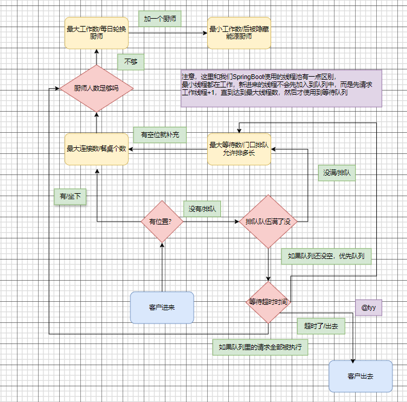

## SpringBoot可以处理的请求数等于最大连接数+最大等待数

理论上是这样的，但是我和[视频](https://www.bilibili.com/video/BV1fApEeAE2S/?spm_id_from=333.1007.tianma.1-2-2.click&vd_source=3c401e9b12aadd668c92b73995070898)中测试的及结果还是不一样，异常数量不相同，这可能是电脑性能或者JVM参数的问题。**回过头来看这段话，其实是超时时间设置的问题，默认的超时时间足够长**。

<br/>

<br/>

```
server:
  tomcat:
    threads:
      #最少线程数
      min-spare: 10
      #最多线程数
      max: 20
    #最大连接数
    max-connections: 30
    #最大等待数
    accept-count: 10
  #端口号
  port: 8099
```

<br/>

下面是我询问ChatGpt4.0-min的回答

```text
假设100个线程访问服务器，以我给的参数，立即20个工作，10的连接未工作，10个排队，60个被拒绝是吗
ChatGPT 说：
是的，按照你给的参数，如果有 100 个线程同时访问服务器，情况如下：

20个工作线程: 服务器的 max 参数限制了最多只能同时处理 20 个请求，所以会有 20 个请求被处理。

10个空闲线程: min-spare 参数确保至少保持 10 个空闲线程，以便能快速响应新的请求。

10个排队连接: accept-count 参数允许有 10 个请求在所有线程忙碌时排队等待处理。

60个被拒绝: 剩下的 60 个请求因为超过了最大连接数和排队数的限制，会被拒绝。

所以最终结果是 20 个请求在工作，10 个请求在空闲，10 个请求在排队，60 个请求被拒绝。
```

<br/>

得到结论：在SpringBoot项目中，可以通过配置内嵌的Tomcat的一些线程池参数来控制请求数量。

所以这个问题的答案就在默认的配置中 ：spring-configuration-metadata.json


<br/>

```
#默认的最大连接数
{
      "name": "server.tomcat.max-connections",
      "type": "java.lang.Integer",
      "description": "Maximum number of connections that the server accepts and processes at any given time. Once the limit has been reached, the operating system may still accept connections based on the \"acceptCount\" property.",
      "sourceType": "org.springframework.boot.autoconfigure.web.ServerProperties$Tomcat",
      "defaultValue": 8192
    },
    
    
#默认的最小线程数
{
      "name": "server.tomcat.threads.min-spare",
      "type": "java.lang.Integer",
      "description": "Minimum amount of worker threads.",
      "sourceType": "org.springframework.boot.autoconfigure.web.ServerProperties$Tomcat$Threads",
      "defaultValue": 10
    },
    
#默认最大线程数
{
      "name": "server.tomcat.threads.max",
      "type": "java.lang.Integer",
      "description": "Maximum amount of worker threads.",
      "sourceType": "org.springframework.boot.autoconfigure.web.ServerProperties$Tomcat$Threads",
      "defaultValue": 200
    },
    
#默认最大等待数
{
      "name": "server.tomcat.accept-count",
      "type": "java.lang.Integer",
      "description": "Maximum queue length for incoming connection requests when all possible request processing threads are in use.",
      "sourceType": "org.springframework.boot.autoconfigure.web.ServerProperties$Tomcat",
      "defaultValue": 100
    }
```

也就是说，最大同时请求数等于最大连接数+最大等待数=8192+100=8292个请求

<br/>

## 高并发环境下如何配置参数

<br/>

### 请求访问项目流程图



<br/>

不是一下子能够学明白的，还是结合实战才能够了解。