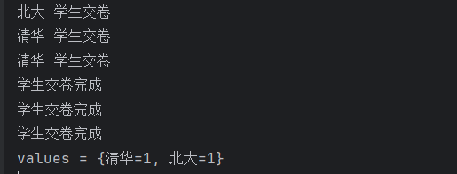
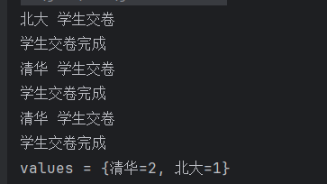
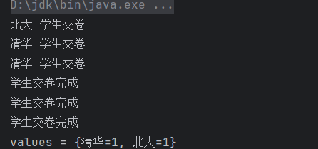
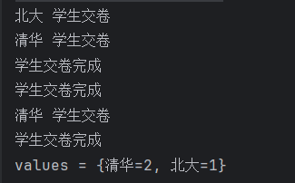
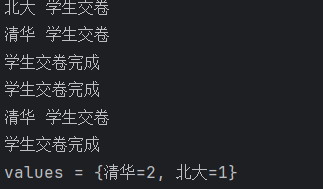

## 背景

首先肯定是可以锁的，但是考虑到场景下的使用，就不能简单的锁住一个字符串了。

[视频链接](https://www.bilibili.com/video/BV1VvtjewEYU/?spm_id_from=333.337.search-card.all.click&vd_source=3c401e9b12aadd668c92b73995070898)

我们假设做一个学生考试系统，并且是一场不同学校的学生的联考（学院同理），来保证安全的同时，最大程度保证性能。

<br/>

## 版本1 不加锁

<br/>

### 代码

```java
package org.example.http;

import org.example.ITestService;
import org.example.dto.TestResponseDto;
import org.example.model.Response;
import org.springframework.web.bind.annotation.GetMapping;
import org.springframework.web.bind.annotation.RequestMapping;
import org.springframework.web.bind.annotation.RestController;

import java.util.concurrent.ConcurrentHashMap;

@RestController
@RequestMapping("test")
public class TestController implements ITestService {


    /**
     * 记录不同学校交卷学生个数
     */
    public static ConcurrentHashMap<String,Integer> values = new ConcurrentHashMap<>();
    /**
     * 模拟学生考试
     * @param school
     * @return
     */
    @GetMapping("/saving")
    @Override
    public Response<TestResponseDto> test(String school) {
        System.out.println(school+" 学生交卷");
        save(school);
        System.out.println("学生交卷完成");
        return Response.<TestResponseDto>builder()
                .data(TestResponseDto.builder()
                        .status(TestResponseDto.Status.SUCCESS)
                        .build())
                .info("交卷被记录")
                .code("200")
                .build();
    }

    private void save(String school) {
        if (values.containsKey(school)) {
            values.put(school,values.get(school)+1);
        }else {
            values.put(school,1);
        }
    }


    public static void main(String[] args) throws InterruptedException {
        TestController testController = new TestController();
        Thread thread1 = new Thread(()->testController.test("北大"));
        Thread thread2 = new Thread(()->testController.test("清华"));
        Thread thread3 = new Thread(()->testController.test("清华"));
        thread1.start();
        thread2.start();
        thread3.start();

        thread1.join();
        thread2.join();
        thread3.join();

        System.out.println("values = " + values);
    }


}

```

### 结果

三个交卷并发执行，出现线程安全问题，一个清华学生的交卷记录被覆盖。



<br/>

<br/>

<br/>

## 版本2 简单上锁

<br/>

### 代码

```
public Response<TestResponseDto> test(String school) {
        synchronized (this){
            System.out.println(school+" 学生交卷");
            save(school);
            System.out.println("学生交卷完成");
            return Response.<TestResponseDto>builder()
                    .data(TestResponseDto.builder()
                            .status(TestResponseDto.Status.SUCCESS)
                            .build())
                    .info("交卷被记录")
                    .code("200")
                    .build();
        }

    }
```

<br/>

### 结果

三个线程挨个执行，效率比较低，锁对象是this，也就是实例对象本身。



<br/>

## 版本3 根据学校区分上锁

### 代码

```java
public Response<TestResponseDto> test(String school) {
        synchronized (school){
            System.out.println(school+" 学生交卷");
            save(school);
            System.out.println("学生交卷完成");
            return Response.<TestResponseDto>builder()
                    .data(TestResponseDto.builder()
                            .status(TestResponseDto.Status.SUCCESS)
                            .build())
                    .info("交卷被记录")
                    .code("200")
                    .build();
        }

    }
    
    
    public static void main(String[] args) throws InterruptedException {
        TestController testController = new TestController();
        Thread thread1 = new Thread(()->testController.test(new String("北大")));
        Thread thread2 = new Thread(()->testController.test(new String("清华")));
        Thread thread3 = new Thread(()->testController.test(new String("清华")));
        thread1.start();
        thread2.start();
        thread3.start();

        thread1.join();
        thread2.join();
        thread3.join();

        System.out.println("values = " + values);
    }
```

### 结果



理论上没有问题，根据学校区分上锁，相同学校之间相互阻塞，不同学校之间不会影响。但是http请求中，我们发送的字符串是以new一个String对象的形式传输给controller的，所以会导致同一个学校但是无法匹配上的问题。

这里使用new来模拟实际生产情况。

<br/>

## 版本4 使用常量设置锁

### 代码

```java
public Response<TestResponseDto> test(String school) {
        synchronized (school.intern()){
            System.out.println(school+" 学生交卷");
            save(school);
            System.out.println("学生交卷完成");
            return Response.<TestResponseDto>builder()
                    .data(TestResponseDto.builder()
                            .status(TestResponseDto.Status.SUCCESS)
                            .build())
                    .info("交卷被记录")
                    .code("200")
                    .build();
        }

    }
```

<br/>

### 结果

成功根据学校做了划分，但是还有问题，这个问题不在学生交卷方面，而是在整个系统的使用方面。

因为**字符串的常量是存在于常量池，常量池是全局共享的**，假设我们还提供另一个服务：办理入学，例如清华的学生办理入学，同时有清华的学生在考试，那么这两者就会相互影响，存在性能问题。



<br/>

## 版本5 不同的接口使用专属的ConcurrentHashMap存储锁资源

### 代码

```java
ConcurrentHashMap<String,Object> testLock = new ConcurrentHashMap<>();
    /**
     * 模拟学生考试
     * @param school
     * @return
     */
    @GetMapping("/saving")
    @Override
    public Response<TestResponseDto> test(String school) {
        //存在就直接返回，不存在执行自定义逻辑
        Object o = testLock.computeIfAbsent(school, s -> new Object());
        synchronized (o){
            System.out.println(school+" 学生交卷");
            save(school);
            System.out.println("学生交卷完成");
            return Response.<TestResponseDto>builder()
                    .data(TestResponseDto.builder()
                            .status(TestResponseDto.Status.SUCCESS)
                            .build())
                    .info("交卷被记录")
                    .code("200")
                    .build();
        }

    }
```

<br/>

### 结果

<br/>


