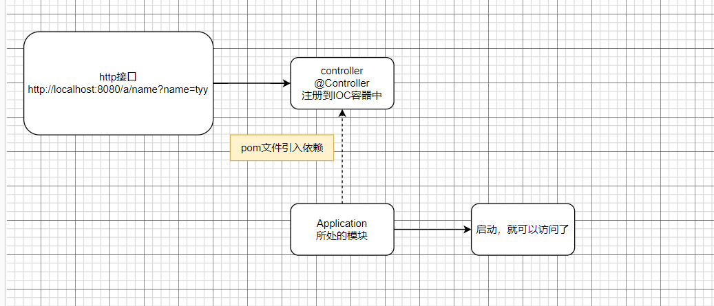
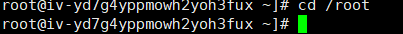
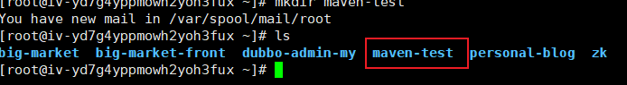
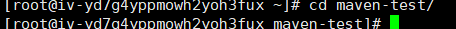
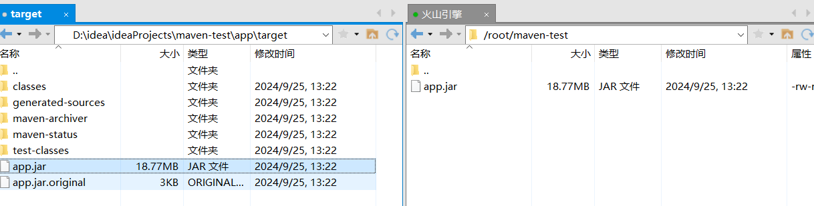
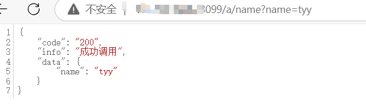

## x起因

从24年2月开始赶鸭子上架，填鸭式的自学springboot和各种技术，虽然跟着做了几何个项目，但是对一个项目最基本的的地方，我总是存在着一些疑问。

为什么别的模块的控制类能在被访问到？maven的xml文件中，那个总是install不到的plugs究竟是干啥用的，每次写一个build标签是为什么？为什么那么多模块打包了，最后只在application所属的包下的jar文件中，就可以启动整个项目？？？

这些问题困扰了我很久，但是时间不等人（我也懒），一直静不下心去思考和学习这些内容，直到。。。

直到我找工作大失败，广投被人狠狠刷kpi，心灰意冷看了两天小说，终于领悟到“我忙个屁，不忙就把这个结症解决一下吧”

于是自己从头到尾写了一个项目启动的demo，终于，我舒服了。（ps：chatgpt真的好用）

<br/>

## 问题

<br/>

### 1.为什么xxx项目的启动类和controller分开，但是能够将该http接口暴露？



<br/>

### 2.如何打包一个项目为jar包，并且可以java -jar xxx.jar启动？

在启动类的pom文件中，添加如下内容

插件：spring-boot-maven-plugin

内容：mainClass 指定启动类

		  repackage 将应用程序打包成一个可执行的 JAR 文件，包含所有的依赖项和资	            源。

<br/>

```xml
<build>
        <plugins>
            <plugin>
                <groupId>org.springframework.boot</groupId>
                <artifactId>spring-boot-maven-plugin</artifactId>
                <version>2.6.0</version>
                <configuration>
                    <mainClass>org.example.Application</mainClass>
                    <layout>JAR</layout>
                </configuration>
                <executions>
                    <execution>
                        <goals>
                            <goal>repackage</goal>
                        </goals>
                    </execution>
                </executions>
            </plugin>
        </plugins>
    </build>
```

<br/>

### 3.如何部署到Docker上

<br/>

1.首先进入到我最爱的root目录下



2.然后创建准备打包镜像的文件夹



3.进入该文件夹



4.创建DockerFile文件，并且编写内容

```
#1.设置基础镜像 java8
FROM openjdk:8-jre-silm
#2.设置作者
LABEL maintainer="tyy"
#3.设置环境变量，方便后面使用，也可以不设置
ENV PORT=8099
JAVA_OPTS="-Xms2048m -Xmx2048m -Dspring.profiles.active=prod -Dserver.port=8099"\
#4.添加应用
COPY /app.jar /app.jar
#5.执行命令
ENTRYPOINT ["sh", "-c", "java  -jar /app.jar"]

```

5.开放端口


6.jar包传入服务器



7.创建镜像

```
docker build -t tyy/app -f ./Dockerfile .
```

8.启动容器

```
docker run -d -p 8099:8099 --name maven-testv1 3ca64d7d0385
```

9.查收

